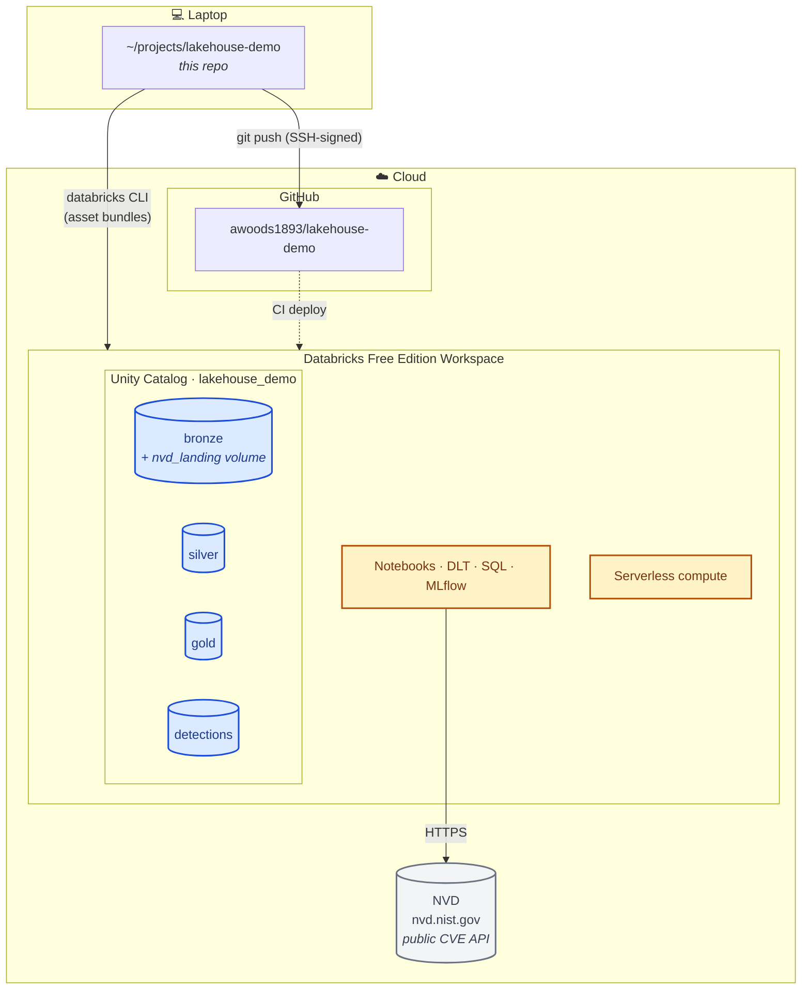
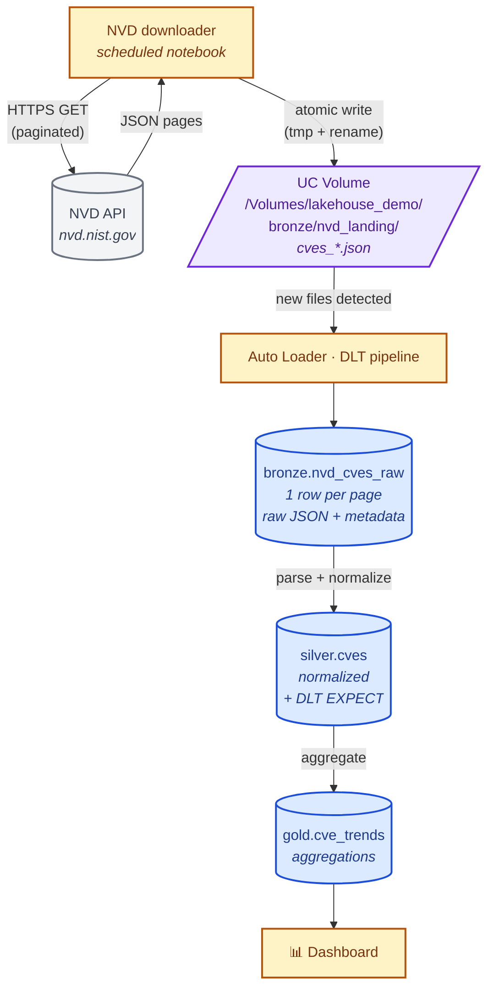
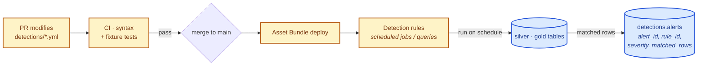
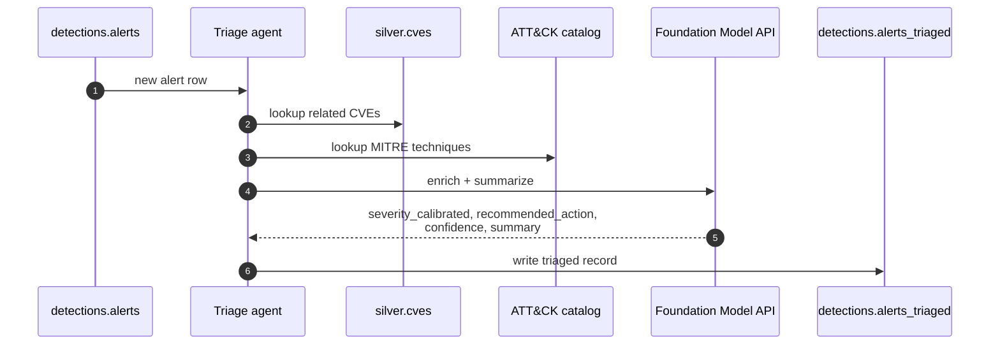
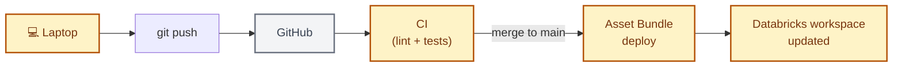
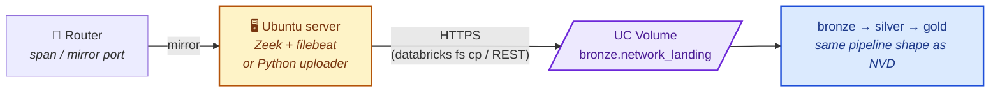

# Architecture & Data Flow

This document explains **what this project is, what it isn't, where the components live, and how data moves through the system**. It's the fastest way to onboard someone (or future-you) to the project.

## What this is

A Databricks-native security data lakehouse, built on **public data only**, that demonstrates the platform patterns underlying [Databricks Lakewatch](https://www.databricks.com/product/lakewatch). The use case is security; the point of the project is platform fluency on Databricks.

## What this is NOT

- ❌ Not connected to your home network
- ❌ Not pulling traffic from your router
- ❌ Not running on your Ubuntu home server
- ❌ Not a production SIEM

If you want a "home SOC" project that *does* collect from your home network, see [Future extensions](#future-extensions). It's a viable separate effort, not part of this scope.

---

## Components — where things live

**Three trust boundaries to be aware of:**
1. **Laptop ↔ GitHub** — SSH keys, signed commits, gitleaks pre-commit
2. **Laptop ↔ Databricks** — OAuth U2M (refresh token at `~/.databricks/token-cache.json`)
3. **Databricks ↔ NVD** — HTTPS, optional NVD API key stored as a Databricks secret

---

## Data flow — NVD CVE pipeline

The main flow the project demonstrates. End-to-end: a CVE published by NIST shows up on the dashboard.

**Key fields produced at each layer:**

| Layer | Table | What's there |
|---|---|---|
| Bronze | `bronze.nvd_cves_raw` | raw JSON column + `file_path`, `ingest_ts`, `source` |
| Silver | `silver.cves` | `cve_id`, `published_at`, `modified_at`, `description`, `cvss_v3_score`, `cvss_v3_severity`, `cwe_ids`, `references` |
| Gold | `gold.cve_trends` | counts by severity by day, top affected vendors, etc. |

---

## Data flow — Detection-as-code (planned)

Detections live in this repo as version-controlled YAML/SQL files (`detections/`). They run on Silver/Gold tables.

---

## Data flow — AI triage (planned)

A small LLM-backed triage step runs after a detection fires. It enriches the alert with related CVE/ATT&CK context and produces a structured summary.

---

## Operational flow — how code gets to the workspace

**The point:** nothing in the workspace is configured by hand. Everything is reproducible from this repo, by anyone with a Free Edition account and the ability to clone.

---

## Future extensions

These are explicitly **out of scope** for the current project but worth noting so the architecture can be extended sensibly later.

### A. Home network telemetry (a "home SOC")

Adds your own network data as another bronze source. Reuses the same bronze→silver→gold shape; only the ingest path changes. Auth from the Ubuntu server uses a service principal with scoped privileges, **not** the user OAuth token.

### B. Real-time threat intel (live feed)

Replace the batch NVD downloader with a streaming source — webhook → Databricks streaming endpoint, or Auto Loader on a continuously-updated bucket. Same downstream layers; only the ingest changes.

### C. SOAR-like response

Wire triaged alerts to a webhook (Slack, PagerDuty, etc.). Useful for the demo; doesn't change architecture meaningfully.
